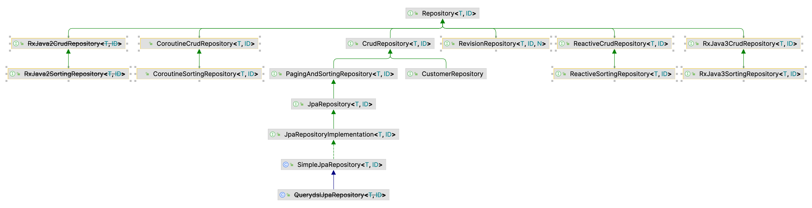

# Spring Data JPA

## 添加依赖

```xml
<dependency>
    <groupId>org.springframework.boot</groupId>
    <artifactId>spring-boot-starter-data-jpa</artifactId>
</dependency>
<dependency>
    <groupId>com.h2database</groupId>
    <artifactId>h2</artifactId>
    <scope>runtime</scope>
</dependency>
```

这里选用的数据库为 H2 数据库，它无需配置连接，停止后数据自动清除，十分便于测试环境。

## 定义实体类

```java
import javax.persistence.Entity;
import javax.persistence.GeneratedValue;
import javax.persistence.GenerationType;
import javax.persistence.Id;

@Entity
public class Customer {

  @Id
  @GeneratedValue(strategy = GenerationType.AUTO)
  private Long id;
  private String firstName;
  private String lastName;

  protected Customer() {
  }

  public Customer(
    String firstName,
    String lastName
  ) {
    this.firstName = firstName;
    this.lastName = lastName;
  }

  @Override
  public String toString() {
    return String.format(
      "Customer[id=%d, firstName='%s', lastName='%s']",
      id, firstName, lastName);
  }

  public Long getId() {
    return id;
  }

  public String getFirstName() {
    return firstName;
  }

  public String getLastName() {
    return lastName;
  }
}
```

首先定义表示数据类的属性，以及两个构造器。
其中空的构造器是给 JPA 用的，我们不该直接调用，需要参数的构造器是给我们用于创建存到数据库里的实体。

冠以 `@Entity` 注解的类表明它是一个 JPA 实体。
我们可以使用 `@Table` 注解来指定对应的表名，这里未指定则默认取类名。

id 这个属性被加上 `@Id` 注解，则表示该属性对应于数据表中的主键。
`@GeneratedValue` 注解则表示我们无需手动设置该字段的值，而是交由 JPA 来生成。
这里生成的策略为自增。

置于其他两个属性，没有被加上任何注解，则对应于数据表中的一个普通字段。

> 如果你使用 mysql 或 postgresql 的话，需要注意表名或者字段名并非保留关键字。
> 比如 [user](https://stackoverflow.com/a/61596969)。

## 定义 CRUD 的接口

Spring Data JPA 最具特色的功能就是它能够在运行时按照我们的接口定义来自动生成实际的方法。

```java
import org.springframework.data.repository.CrudRepository;

import java.util.List;

public interface CustomerRepository extends CrudRepository<Customer, Long> {

  List<Customer> findByLastName(String lastName);

  Customer findById(long id);
}
```

让 CustomerRepository 继承自 CrudRepository 接口，使用范型参数指定实体类及其主键类型。
通过继承，我们默认的就具有了一些增删改查的函数，你也可以继承其他接口获得更丰富的预置功能。
然后通过定义方法的名称，我们就能拥有对应功能的数据库操作。



等到程序启动时，Spring Data JPA 会为我们创建此接口的一个实现，无需我们再写额外的代码。

## 测试功能

```java
import lombok.extern.log4j.Log4j2;
import org.springframework.boot.CommandLineRunner;
import org.springframework.context.annotation.Bean;

@Log4j2
@Bean
public CommandLineRunner demo(CustomerRepository repository) {
  return (args) -> {
    // save a few customers
    repository.save(new Customer("Jack", "Bauer"));
    repository.save(new Customer("Chloe", "O'Brian"));
    repository.save(new Customer("Kim", "Bauer"));
    repository.save(new Customer("David", "Palmer"));
    repository.save(new Customer("Michelle", "Dessler"));

    // fetch all customers
    log.info("Customers found with findAll():");
    log.info("-------------------------------");
    for (Customer customer : repository.findAll()) {
      log.info(customer.toString());
    }
    log.info("");

    // fetch an individual customer by ID
    Customer customer = repository.findById(1L);
    log.info("Customer found with findById(1L):");
    log.info("--------------------------------");
    log.info(customer.toString());
    log.info("");

    // fetch customers by last name
    log.info("Customer found with findByLastName('Bauer'):");
    log.info("--------------------------------------------");
    repository.findByLastName("Bauer").forEach(bauer -> {
      log.info(bauer.toString());
    });
    // for (Customer bauer : repository.findByLastName("Bauer")) {
    //  log.info(bauer.toString());
    // }
    log.info("");
  };
}
```

将一个返回值类型为 `CommandLineRunner` 的函数，加上 `@Bean` 的注解。
该函数返回一个 lamda，因此其中的内容会在程序启动时自动执行。

通过注入我们定义的接口到函数参数，我们能方便的进行数据库操作。
首先执行继承来的 save 方法创建数据，findAll 方法查询全部数据。
然后执行自定义的查询方法。

## 参考

- [Accessing Data with JPA](https://spring.io/guides/gs/accessing-data-jpa/)
- [Accessing JPA Data with REST](https://spring.io/guides/gs/accessing-data-rest/)
